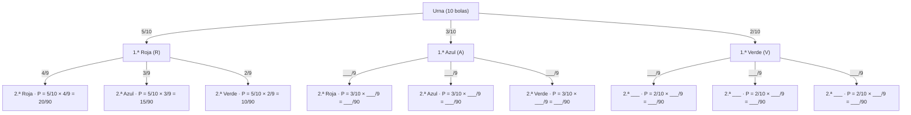

# Diagrama de árbol — Experimento A (guiado)

**Urna:** 5 bolas rojas (R), 3 azules (A), 2 verdes (V) · Total: 10 bolas  
**Extracción:** dos bolas **sin reemplazamiento**

> **Cómo usarlo:** la rama de la primera roja está completa y sirve de modelo.
> Las ramas de azul y verde tienen huecos `___` que debéis completar.
> Recordad: al sacar la primera bola, el total pasa de 10 a 9.

---

---

## Preguntas del expediente

Completad el árbol y responded:

| Pregunta | Desarrollo | Resultado |
|---|---|---|
| P (dos bolas rojas) | 5/10 × ___/9 = | ___ |
| P (una roja y una azul, en cualquier orden) | 5/10 × ___/9 + ___/10 × ___/9 = | ___ |
| ¿Cambia el resultado con reemplazamiento? ¿Por qué? | | |

---

## Pista

> Con reemplazamiento, antes de la segunda extracción la bola vuelve a la urna.
> ¿Cuántas bolas habría entonces? ¿Cambian las probabilidades de la segunda rama?

---

## Comprobación final

Cuando hayáis completado todas las ramas, sumad todas las probabilidades.  
Si está bien hecho, el resultado debe ser:

$$\text{Suma de todas las ramas} = \frac{\_\_\_}{90} = 1$$
