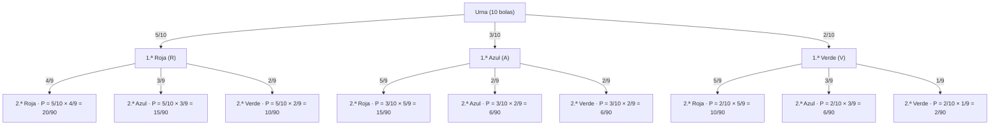

# Diagrama de árbol — Experimento A (completo)

**Urna:** 5 bolas rojas (R), 3 azules (A), 2 verdes (V) · Total: 10 bolas  
**Extracción:** dos bolas **sin reemplazamiento**

> Recuerda: al sacar la primera bola, el total pasa de 10 a 9. Las probabilidades de la segunda extracción cambian según lo que salió primero.

---

---

## Comprobación: suma de todas las ramas

La suma de todas las probabilidades debe ser igual a 1:

| Rama | Probabilidad | Fracción |
|---|---|---|
| R → R | 5/10 × 4/9 | 20/90 |
| R → A | 5/10 × 3/9 | 15/90 |
| R → V | 5/10 × 2/9 | 10/90 |
| A → R | 3/10 × 5/9 | 15/90 |
| A → A | 3/10 × 2/9 | 6/90 |
| A → V | 3/10 × 2/9 | 6/90 |
| V → R | 2/10 × 5/9 | 10/90 |
| V → A | 2/10 × 3/9 | 6/90 |
| V → V | 2/10 × 1/9 | 2/90 |
| **TOTAL** | | **90/90 = 1** ✓ |

---

## Respuestas a las preguntas del expediente

**P (dos bolas rojas):**
$$P(R \cap R) = \frac{5}{10} \times \frac{4}{9} = \frac{20}{90} \approx 0{,}222$$

**P (una roja y una azul, en cualquier orden):**
$$P(R \cap A) + P(A \cap R) = \frac{5}{10} \times \frac{3}{9} + \frac{3}{10} \times \frac{5}{9} = \frac{15}{90} + \frac{15}{90} = \frac{30}{90} \approx 0{,}333$$

**¿Cambia el resultado con reemplazamiento?**  
Sí. Con reemplazamiento, la urna vuelve a tener 10 bolas antes de la segunda extracción, por lo que las probabilidades de la segunda extracción no dependen de la primera:

$$P(R \cap R)_{\text{con reempl.}} = \frac{5}{10} \times \frac{5}{10} = \frac{25}{100} = 0{,}25$$

El resultado cambia porque con reemplazamiento los sucesos son **independientes**, mientras que sin reemplazamiento son **dependientes**.
